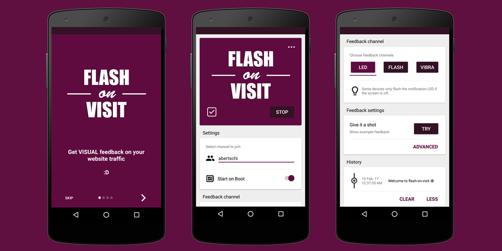

[](https://opensource.org/licenses/Apache-2.0)
[](http://twitter.com/andrinbertschi)

# flash-on-visit

> It's often the small things that matter most in life.  

**flash-on-visit** gives you visual feedback on your website traffic by flashing the caps lock LED of your computer keyboard and notification light of your Android phone :yellow_heart:


This app is in beta development :feet:  Feedback appreciated!

## Android client

<p align="center">
  
</p>

[Download the App from Google Play Store](https://play.google.com/store/apps/details?id=ch.abertschi.flashonvisit) 🔥
## MacOS client
The MacOS client is a Node.js app.  
Check out [client_macos/README.md](client_macos/README.md) for installation instructions.

## Integrate on your website
Perform an HTTP GET request on `http://213.136.81.179:3004/channels/<channel>` where `<channel>` is an identifier for your website. The most straigth forward approach to achieve that is by using the script [client_browser/flash-on-visit.js](client_browser/flash-on-visit.js) as following:

```html
<html>
<head>
    <script src="./lash-on-visit.js" /></script>
</head>
<body>
    <h1>Your awesome website 🚀</h1>
    <script>
        fov.send('http://213.136.81.179:3004', 'abertschi');
    </script>
</body>
```

This will notify clients listening for notifications in the set channel.

## Host your own backend
A current version of [server/server.js](server/server.js) is running on my server.  
The backend is a Node.js app running `express` and `socket.io` features a hook to notify Android clients
with Google's Firebase Cloud Messaging (FCM) Service.

In case you wanted to host your own server, you would have to setup a Firebase account and rebuild the Android client with your own credentials.

i.e. set these files:
- `./android/app/google-services.json` Credentials to receive Firebase Cloud Messaging notifications
- `./server/gcs_server_key.js`: API Key to send Firebase Cloud Messaging notifications

## Contributing

Help is always welcome :yellow_heart:. Contribute to the project by forking and submitting a pull request.

### Credits
Thanks to these amazing people:  
* [KDB223](https://github.com/KDB223) with his work on [LEDControl](https://github.com/KDB223/LEDControl), Apache License Version 2.0


## Contact
Andrin Bertschi  
www.abertschi.ch  
